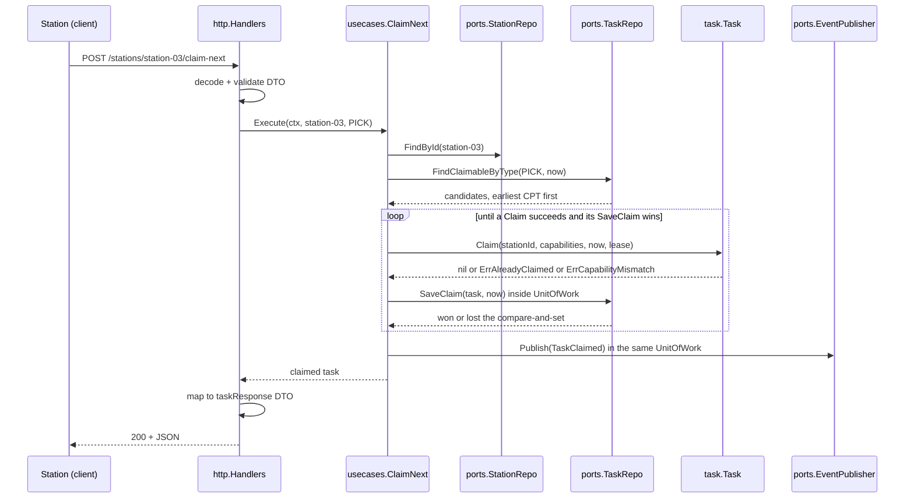

# Use cases & ports

The application layer is one struct per use case, each holding its
dependencies as plain fields. There is no DI container and no base class. Each
use case depends only on the domain and on `ports` — never on an adapter.

## The seventeen use cases

One file each in `internal/application/usecases/`.

| # | Use case | Signature (abridged) | Raises | Endpoint |
| --- | --- | --- | --- | --- |
| 1 | `CreateTask` | `Execute(ctx, taskType, cpt, orderRef, required, fragile, giftWrap) (*Task, error)` | `TaskCreated` | `POST /tasks` (behind the `Idempotency-Key` middleware when Postgres is wired, ADR-0028); also the `WorkReleased` consumer and `ArriveAtRebin` |
| 2 | `ClaimNext` | `Execute(ctx, stationId, taskType) (*Task, error)` | `TaskClaimed` | `POST /stations/{stationId}/claim-next` |
| 3 | `RenewLease` | `Execute(ctx, taskId, stationId) error` | — | `POST /tasks/{id}/renew-lease` |
| 4 | `CompleteTask` | `Execute(ctx, taskId, stationId) error` | `TaskCompleted` | `POST /tasks/{id}/complete`; MCP `complete_task` |
| 5 | `SealPackage` | `Execute(ctx, taskId, stationId, contents) (*Package, error)` | `PackageSealed` | `POST /tasks/{id}/seal-package` |
| 6 | `RunSlam` | `Execute(ctx, packageId, actualWeight, expectedWeight) error` | `LabelApplied` + `PackageManifested` **or** `WeightDiscrepancyDetected` + `PackageDiverted` | `POST /packages/{id}/slam` |
| 7 | `GetQueueDepth` | `Execute(ctx, taskType) (int, error)` | — | `GET /queues/{taskType}/depth`; MCP `get_queue_status` and the `queue://fulfillment/...` resources |
| 8 | `ExpireLeases` | `Execute(ctx) (int, error)` | `LeaseExpired` per task freed | `POST /tasks/expire-leases` |
| 9 | `RegisterStation` | `Execute(ctx, stationId, capabilities, locationCode) (*Station, error)` | — | `POST /stations` |
| 10 | `CheckInStation` | `Execute(ctx, stationId, occupant) (*Station, error)` | — | `POST /stations/{stationId}/check-in` |
| 11 | `CheckOutStation` | `Execute(ctx, stationId) (*Station, error)` | — | `POST /stations/{stationId}/check-out` |
| 12 | `GetTasksByOrderRef` | `Execute(ctx, orderRef) ([]*Task, error)` | — | `GET /tasks?orderRef=` |
| 13 | `GetInstalledCapacity` | `Execute(ctx, capability) (int, error)` | — | `GET /capacity/{capability}` |
| 14 | `SweepCPTMisses` | `Execute(ctx) (int, error)` | `TaskCPTMissed` per overdue open task | `POST /tasks/sweep-cpt-misses` |
| 15 | `ArriveAtRebin` | `Execute(ctx, orderRef, lineId, requiredLineIds, packCPT, packRequired, packFragile, packGiftWrap) error` | `ItemArrivedAtRebin`; on completion also `TaskCreated` (via `CreateTask`) + `OrderConsolidated` | `POST /rebin/arrivals` |
| 16 | `GetPackage` | `Execute(ctx, packageId) (*Package, error)` | — | `GET /packages/{id}` ([ADR-0033](../adr/0033-package-read-model.md)) |
| 17 | `GetPackagesByOrderRef` | `Execute(ctx, orderRef) ([]*Package, error)` | — | `GET /packages?orderRef=` ([ADR-0033](../adr/0033-package-read-model.md)) |

The MCP tools `find_claimable_work` and `diagnose_stuck_tasks` read
`TaskRepo` directly through a narrow query port (`mcp.TaskQueries`) rather
than through a use case; the two report tools call `cmd/fulfillment-reports`
over REST.

`RegisterStation` exists to close a real gap — without it, a freshly started
server had no way to create a `Station` over HTTP, so every `claim-next` call
returned "station not found." Check-in/out record the station's occupant for
labor attribution ([ADR-0014](../adr/0014-labor-performance-integration-hooks.md));
`GetInstalledCapacity` backs Workforce Management's capacity read
([ADR-0018](../adr/0018-installed-capacity-read-endpoint.md)); `SweepCPTMisses`
is the promise-feedback sweep
([ADR-0025](../adr/0025-cpt-missed-sweep-and-package-manifested.md));
`ArriveAtRebin` is the Rebin fan-in
([ADR-0016](../adr/0016-rebin-and-order-consolidation.md)).

Every state-changing use case that raises events wraps its save + publish in
`ports.UnitOfWork` when one is wired, so with Postgres the state change and
the outbox row commit atomically
([ADR-0020](../adr/0020-transactional-outbox.md)). `RenewLease`,
`RegisterStation`, `CheckInStation` and `CheckOutStation` raise nothing and
save directly.

## Notes on the ones with subtleties

### `ClaimNext` — the pull dispatcher

```go
st, _ := uc.Stations.FindById(ctx, stationId)          // capabilities come from the registered Station
if st == nil { return nil, ErrStationNotFound }

now := uc.Clock.Now()
candidates, _ := uc.Tasks.FindClaimableByType(ctx, taskType, now)   // earliest-CPT-first

for _, t := range candidates {
    if t.Claim(stationId, st.Capabilities(), now, leaseDuration) != nil {
        continue                                        // capability mismatch etc.: try the next one
    }
    won, _ := uc.persistClaim(ctx, t, stationId, now)  // SaveClaim CAS + Publish(TaskClaimed), one UnitOfWork
    if !won {
        continue                                        // another station's claim committed first
    }
    return t, nil
}
return nil, ErrNoClaimableTask
```

Four things worth noticing:

1. **Capabilities are resolved server-side.** The ubiquitous-language name is
   `claimNext(stationId, capabilities)`, but the HTTP request body carries only
   `taskType` — the capability set comes from the persisted `Station`. A client
   cannot claim work by *asserting* capabilities it does not have. The
   conceptual signature and the wire signature differ on purpose.
2. **The loop skips rather than fails.** If the earliest-CPT candidate does not
   match this station's capabilities, `Claim` returns an error and the loop
   simply moves to the next candidate. The result is "the earliest-CPT task
   this station can actually do."
3. **The save is a compare-and-set.** `FindClaimableByType` is a plain read,
   so concurrent stations can load the same Pending task. `TaskRepo.SaveClaim`
   only writes while the stored row is still claimable
   (`status = 'PENDING' OR (status = 'CLAIMED' AND lease_expiry <= now)`);
   the losers get `won=false`, publish nothing, and move on
   ([ADR-0034](../adr/0034-concurrency-control-for-consolidation-and-claim.md)).
4. **An empty result is `ErrNoClaimableTask`, not an empty 200.** An idle
   station gets a definite answer, mapped to `409` — see
   [ADR-0005](../adr/0005-rfc-7807-problem-details.md) for the status-code
   reasoning.

### `SealPackage` — a cross-aggregate rule in the right place

It reads the `Task` to check three things — that it exists, that it is a
`PACK` task (`ErrWrongTaskType`), and that `stationId` holds the active,
unexpired claim (`Task.VerifyHeldBy` → `task.ErrNotClaimed` for a missing or
lapsed lease — a lapsed lease cannot seal even before a sweep frees the task —
and `task.ErrNotOwner` for an active lease of another station, ADR-0038) — then writes only the new `Package`. Neither aggregate
is asked to know about the other; the rule lives in the layer that can see
both. It is idempotent on the task id: `PackageRepo.FindByTaskId` runs first
and a retried call returns the already-sealed package (backed by the
partial unique index on `packages.task_id`, migration 0011).

When `ClassificationLookup` (`ports.ProductClassificationLookup`) is wired,
`SealPackage` also performs a classification lookup per scanned SKU — see
[ADR-0010](../adr/0010-package-segregation-and-sort-lane.md); since
[ADR-0039](../adr/0039-product-classification-local-copy.md) it reads the
local copy of product-master's `ProductClassified`
(`PRODUCT_CLASSIFICATION_MODE=kafka`), not a synchronous call to
inventory-storage.
Unlike `Fragile`, this cannot be stamped onto `Task` at release time: a
Pack task's contents are discovered live at the scan station, not known
when the task was released. The port is nil-safe (permissive by default),
mirroring `inventory-storage`'s own `LocationLookup` pattern on `StowStock`.

### `ExpireLeases` — the sweep

Takes no `now` argument: time comes from `ports.Clock`. It walks every
`Claimed` task, calls `ExpireLeaseIfDue`, and for each task it frees, saves it
and publishes `LeaseExpired`, returning the count. On a save or publish error
it returns the count freed *so far* alongside the error rather than zero — a
partial sweep is reported honestly.

### `RegisterStation` — idempotent by design

Re-registering an existing `stationId` **updates** its capability set rather
than erroring. Recertifying a station is a legitimate operational action, not
a conflict. It publishes nothing: no domain event fits "a station was
registered," and inventing one purely for symmetry was rejected.

An optional `locationCode` ties the station to a facility-layout location.
When `ports.LocationRoleLookup` is wired (`LOCATION_ROLE_MODE=http`), a code
whose known role is not `WorkCenter` is rejected with
`ErrStationLocationNotWorkCenter` (`422`); an unknown code or an unwired
lookup is accepted unchecked
([ADR-0024](../adr/0024-station-location-code-and-workcenter-role-check.md)).

### `SweepCPTMisses` — the other sweep

Same shape as `ExpireLeases`: no `now` argument, time from `ports.Clock`.
It asks `TaskRepo.FindOpenPastCPT(now)` for every Pending or Claimed task
at or past its CPT and publishes one `TaskCPTMissed` per task. It changes no
task state, so an overdue task re-fires on every pass until it completes —
each pass is a new event `id`, so consumers must be idempotent on their own
business key.

### `ArriveAtRebin` — serialized per order

The read-modify-write of the `OrderConsolidation` runs inside the unit of
work behind `OrderConsolidationRepo.FindByOrderRefForUpdate`, which takes a
transaction-scoped advisory lock on the order ref plus `SELECT ... FOR
UPDATE` in Postgres, so two lines arriving at once are serialized and none
is lost ([ADR-0034](../adr/0034-concurrency-control-for-consolidation-and-claim.md)).
The PACK task is created exactly once — on the arrival that first completes
the set; later arrivals for a complete order are no-ops.

## The outbound ports

All in `internal/application/ports/ports.go` (plus the deliberately
unimplemented `EquipmentCommandPort` in `equipment.go`, ADR-0015). The
application layer depends on these interfaces; adapters implement them.

| Port | Methods | Implemented by |
| --- | --- | --- |
| `TaskRepo` | `Save`, `SaveClaim`, `FindById`, `FindClaimableByType`, `FindAllClaimed`, `FindOpenPastCPT`, `CountByTypeAndStatus`, `FindByOrderRef` | `memory`, `postgres` |
| `StationRepo` | `Save`, `FindById`, `CountByCapability` | `memory`, `postgres` |
| `OrderConsolidationRepo` | `Save`, `FindByOrderRef`, `FindByOrderRefForUpdate` | `memory`, `postgres` |
| `PackageRepo` | `Save`, `FindById`, `FindByTaskId`, `FindByOrderRef` | `memory`, `postgres` |
| `EventPublisher` | `Publish(ctx, events...)` | `events` (log / buffered / multi), `kafka` (integration + analytics), `postgres.OutboxPublisher` |
| `Clock` | `Now()` | `memory.SystemClock`, fixed clocks in tests |
| `ProcessedEvents` | `MarkProcessed(ctx, eventId) (bool, error)` | `memory`, `postgres` |
| `ProductClassificationLookup` | `GetClassification(ctx, sku) (ClassificationInfo, error)` | `productclassificationcopy` (Postgres / in-memory local copy, permissive no-op; ADR-0039) |
| `ProductClassificationCopy` | `UpsertIfNewer(ctx, rec) (bool, error)` | `productclassificationcopy` (written by `ApplyProductClassified`) |
| `LocationRoleLookup` | `GetRole(ctx, locationCode) (LocationRoleInfo, error)` | `facilitylayout` (http client, permissive no-op) |
| `PathCatalogue` | `Lookup(pathId)` | `pathcatalog.Catalogue`, loaded by `filecatalog` or `kafkacatalog` |
| `UnitOfWork` | `Execute(ctx, fn)` | `postgres` (transaction + outbox); nil in memory mode |
| `Metrics` | `TaskClaimed`, `TaskCompleted` | OpenTelemetry meter (`internal/observability`) |

### Two ports that carry design weight

**`Clock`** exists so that lease expiry is deterministic. Every use case that
cares about time takes `now` from `uc.Clock.Now()` and passes it *into* the
domain. No domain method calls `time.Now()`. A test asserting "an unrenewed
lease frees the task after five minutes" advances a fixed clock; it does not
sleep.

**`ProcessedEvents`** is what makes Kafka's at-least-once delivery safe.
`MarkProcessed` returns `true` only if this call newly recorded the id — so
the consumer's check is a single atomic operation, not a read-then-write race.
The Postgres adapter backs it with a `processed_events (event_id PRIMARY KEY,
processed_at)` table, where the primary-key violation *is* the deduplication;
the memory adapter uses a mutex-guarded map.

### `FindClaimableByType` carries the dispatch policy

Its contract is "Pending or lease-expired tasks of this type, **ordered by
earliest CPT first**." Because `ClaimNext` has no optimiser, that ordering
*is* the dispatch policy — any future sophistication (aisle batching,
interleaving) would have to change this query, which is exactly where it
should live.

## How the layers connect



Source: `internal/application/usecases/claim_next.go`,
`internal/adapters/inbound/http/handlers.go`. The full set of per-use-case
sequence diagrams is on [Sequence diagrams](./sequence-diagrams.md).

The handler never touches a domain type on the way out — it maps to a DTO
defined in `internal/adapters/inbound/http/dto.go`. Domain structs are not
serialised onto the wire.
